# AI 기능 상세 가이드

  <a href="AI_FEATURES_en.md">English</a> | <a href="AI_FEATURES_ja.md">日本語</a>

> [메인 README로 돌아가기](../README.md)

---

## 목차

1. [명암 생성 (AI Shading)](#1-명암-생성-ai-shading)
2. [밑색 생성 (AI Colorize)](#2-밑색-생성-ai-colorize)
3. [캐릭터 시트 생성](#3-캐릭터-시트-생성)
4. [선화 생성 (AI Line Art)](#4-선화-생성-ai-line-art)
5. [영역 분리 (AI Segmentation)](#5-영역-분리-ai-segmentation)

---

## 1. 명암 생성 (AI Shading)

선화 이미지에 AI가 자동으로 명암을 생성합니다. 4가지 변형 후보 중 마음에 드는 것을 선택할 수 있으며, 명암 레이어가 자동으로 추가됩니다.

> 크레딧: 0.0825 크레딧 / 1회

### 사용 방법

**Step 1.** 캔버스에 선화를 준비한 뒤 AI Features 패널에서 명암 생성 버튼을 클릭합니다.

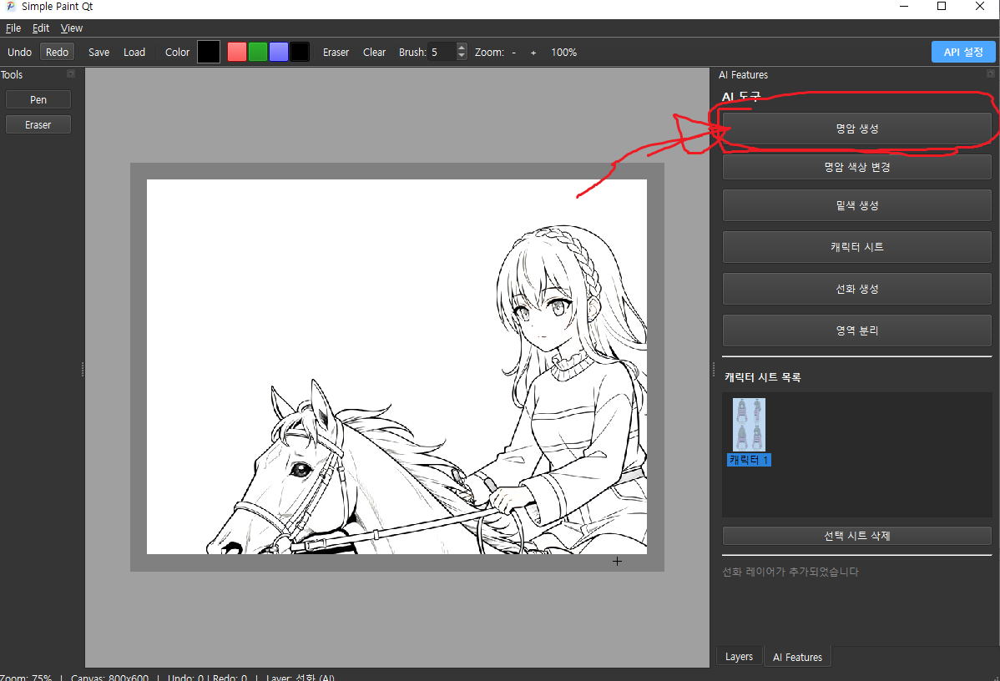

**Step 2.** 영역 선택 — 명암을 적용할 영역을 드래그하여 선택합니다. Shift+드래그로 다중 영역 선택이 가능하며, ESC로 취소할 수 있습니다.

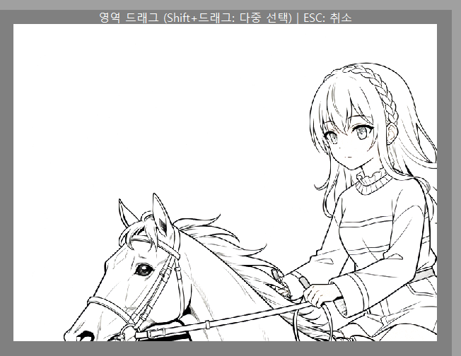

**Step 3.** 명암 스타일 선택 — 원하는 명암 스타일을 선택합니다. 건너뛰기(AI 자동 선택)도 가능합니다.

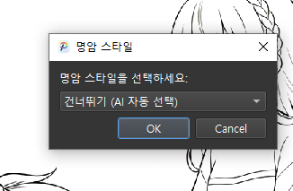

**Step 4.** AI가 4가지 변형 후보를 생성합니다. 원하는 변형을 클릭하여 선택합니다.

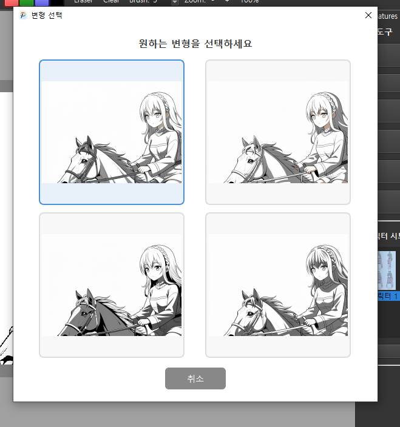

**Step 5.** 선택한 명암이 명암 (AI) 레이어로 자동 추가되어 선화 아래에 배치됩니다.

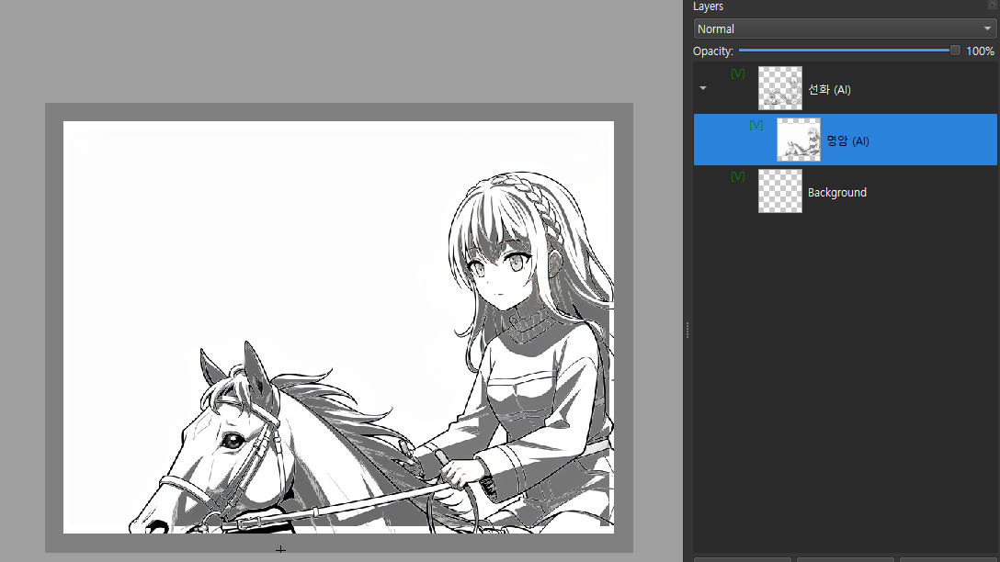

### 기타: 명암색 변환

명암 생성 후, 명암 색상 변경 버튼을 사용하면 회색 톤의 명암을 원하는 컬러로 변환할 수 있습니다. 명암 레이어를 선택한 뒤 변환할 색상을 지정하면 다양한 분위기를 연출할 수 있습니다. 이 기능은 AI가 아닌 이미지 처리 기능입니다.

---

## 2. 밑색 생성 (AI Colorize)

선화에 AI가 자동으로 플랫 컬러링을 적용합니다. 캐릭터 시트를 참조하면 일관된 색상을 유지할 수 있으며, 4가지 변형 후보 중 선택 가능합니다.

> 크레딧: 0.0825 크레딧 / 1회

### 사용 방법

**Step 1.** 캔버스에 선화를 준비한 뒤 AI Features 패널에서 밑색 생성 버튼을 클릭합니다.

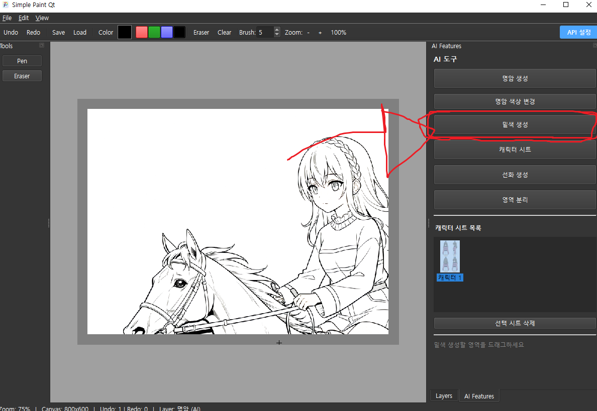

**Step 2.** 영역 선택 — 밑색을 적용할 영역을 드래그하여 선택합니다. ESC로 취소할 수 있습니다.

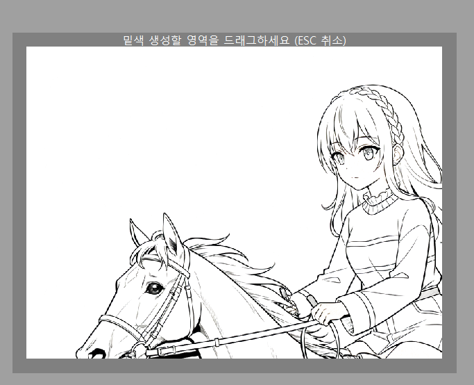

**Step 3.** 캐릭터 시트 선택 — 색상 참조용 캐릭터 시트를 선택합니다. Ctrl+클릭으로 다중 선택이 가능하며, 파일에서 불러오거나 참고 안함도 선택할 수 있습니다.

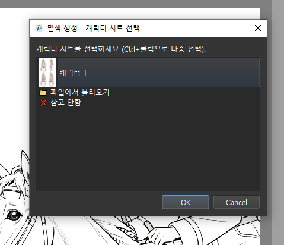

**Step 4.** AI가 4가지 변형 후보를 생성합니다. 원하는 변형을 클릭하여 선택합니다.

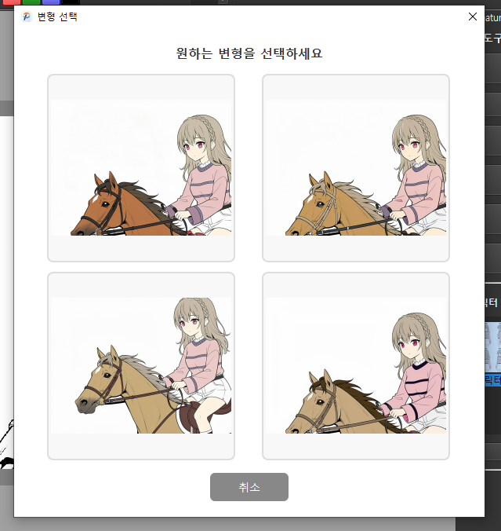

**Step 5.** 선택한 밑색이 밑색 (AI) 레이어로 자동 추가되어 선화와 명암 사이에 배치됩니다.

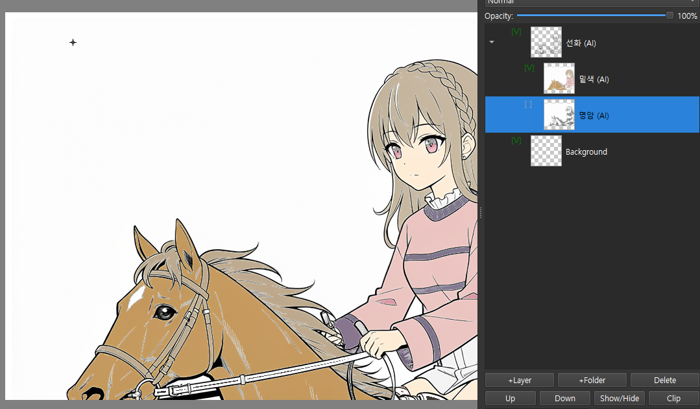

> **팁:** 캐릭터 시트를 참조한 경우, 별도의 색상 지시를 입력하지 않는 편이 더 자연스러운 결과를 얻을 수 있습니다.

---

## 3. 캐릭터 시트 생성

캔버스의 그림이나 외부 이미지를 참조하여 정면, 측면, 후면, 반측면 4방향 턴어라운드 캐릭터 시트를 AI로 자동 생성합니다.

> 크레딧: 0.264 크레딧 / 1회

### 사용 방법

**Step 1.** AI Features 패널에서 캐릭터 시트 버튼을 클릭합니다.

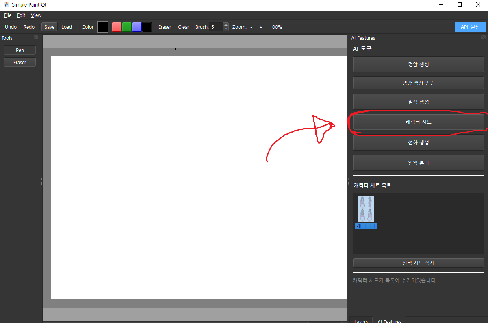

**Step 2.** 스타일 선택 — 풍부한 시트 (Flux): 디테일이 풍부한 고품질 시트 / 밑색 시트 (Gemini): 플랫 컬러 기반의 간결한 시트

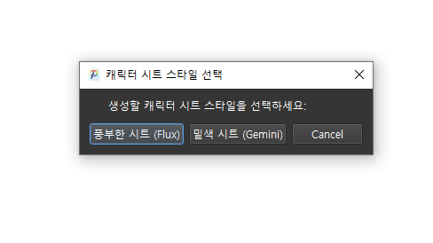

**Step 3.** 레퍼런스 이미지 선택 — 캔버스에서 영역 선택 또는 파일에서 불러오기

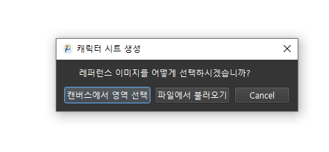

**Step 4.** 캐릭터 이름을 입력합니다.

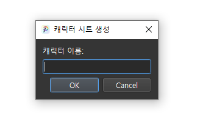

**Step 5.** AI가 4방향 뷰(정면, 측면, 후면, 반측면)를 자동 생성합니다.

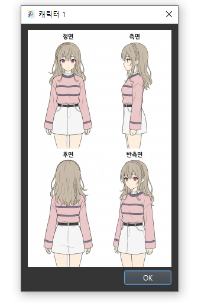

**Step 6.** 생성된 시트는 캐릭터 시트 목록에 저장되며, 클릭하여 언제든지 확인할 수 있습니다. 필요 없는 시트는 선택 시트 삭제로 제거 가능합니다.

---

## 4. 선화 생성 (AI Line Art)

캐릭터 시트를 참조하여 원하는 포즈와 장면의 선화를 AI로 자동 생성합니다. 4가지 변형 후보 중 마음에 드는 것을 선택할 수 있습니다.

> 크레딧: 0.0825 크레딧 / 1회

### 사용 방법

**Step 1.** AI Features 패널에서 선화 생성 버튼을 클릭합니다.

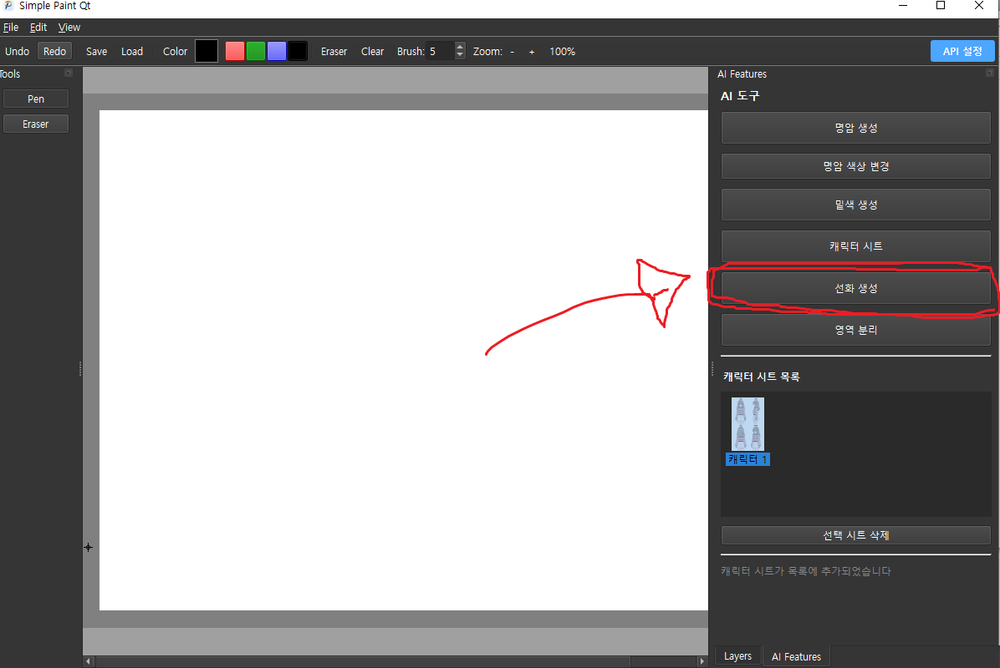

**Step 2.** 캐릭터 시트 선택 — 참조할 캐릭터 시트를 선택합니다. Ctrl+클릭으로 다중 선택이 가능하며, 파일에서 불러오거나 참고 안함도 선택할 수 있습니다.

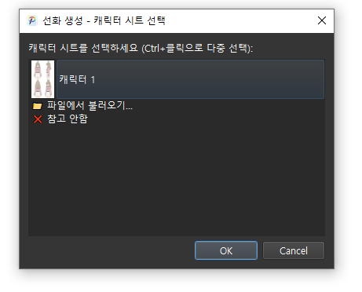

**Step 3.** 포즈/장면 설명 — 생성할 포즈나 장면을 텍스트로 설명합니다. (예: 달리는 포즈, 앉아서 책 읽는 모습, 손 흔드는 장면)

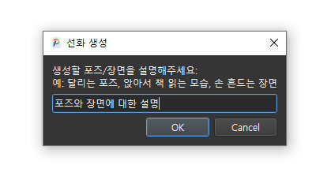

**Step 4.** 선화 스타일 선택 — 원하는 선화 스타일을 선택합니다. 건너뛰기(AI 자동 선택)도 가능합니다.

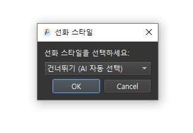

**Step 5.** 출력 비율 선택 — 출력 이미지 비율을 선택합니다. (1:1 정사각형 등)

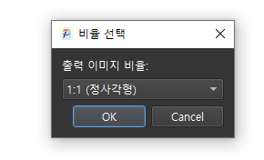

**Step 6.** AI가 4가지 변형 후보를 생성합니다. 원하는 변형을 클릭하여 선택합니다.

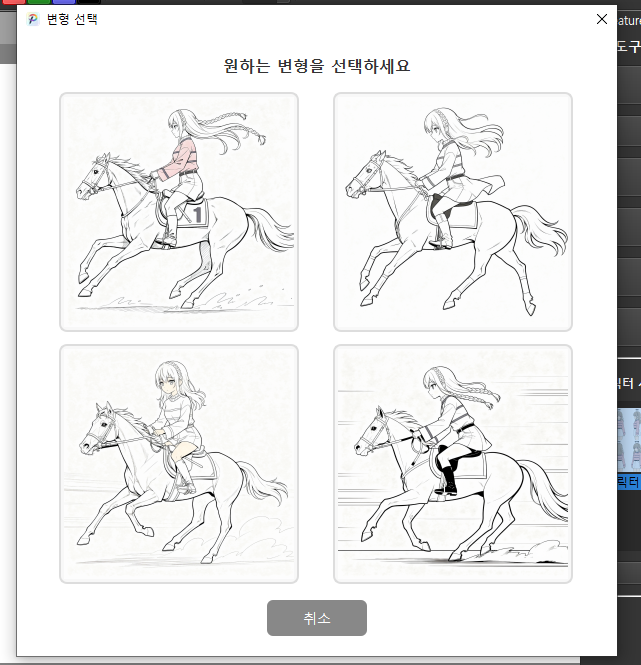

**Step 7.** 레이어 추가 확인 — 생성된 선화를 새 레이어로 추가할지 선택합니다.

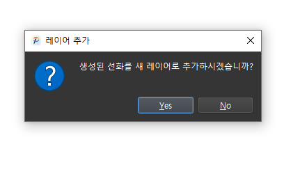

**Step 8.** 선택한 선화가 캔버스에 새 레이어로 추가됩니다.

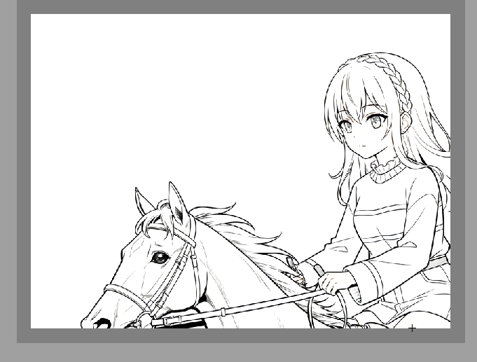

---

## 5. 영역 분리 (AI Segmentation)

이미지를 의미 단위(인물, 배경 등)로 자동 분리하여 각각 별도의 레이어로 만들어줍니다. 선화, 밑색, 명암 레이어를 한꺼번에 분리할 수 있습니다.

### 사용 방법

**Step 1.** AI Features 패널에서 영역 분리 버튼을 클릭합니다.

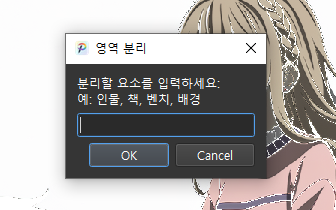

**Step 2.** 분리할 요소 입력 — 분리하고 싶은 요소를 텍스트로 입력합니다. (예: 인물, 책, 벤치, 배경)

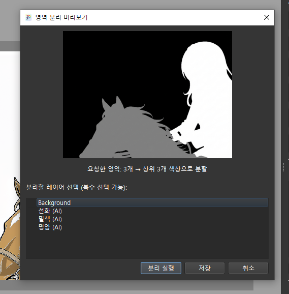

**Step 3.** 미리보기 및 레이어 선택 — 영역 분리 미리보기가 표시되며, 분리할 레이어를 복수 선택할 수 있습니다. (예: Background, 선화, 밑색, 명암) 분리 실행 또는 저장을 선택합니다.

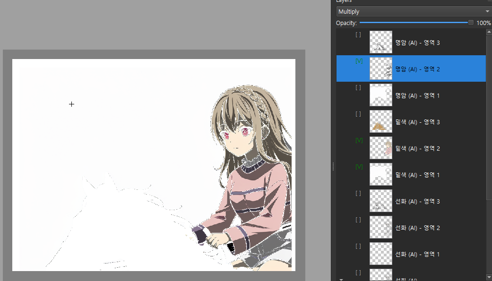

**Step 4.** 선택한 레이어들이 각 영역별로 분리되어 개별 레이어로 추가됩니다. (예: 선화 (AI) - 영역 1/2/3, 밑색 (AI) - 영역 1/2/3, 명암 (AI) - 영역 1/2/3)
